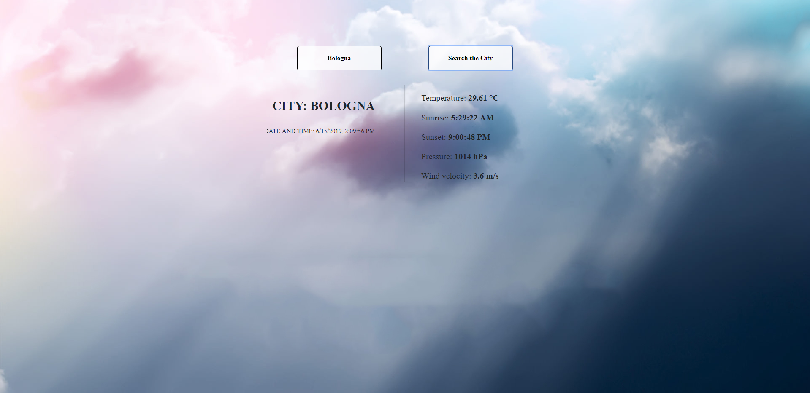
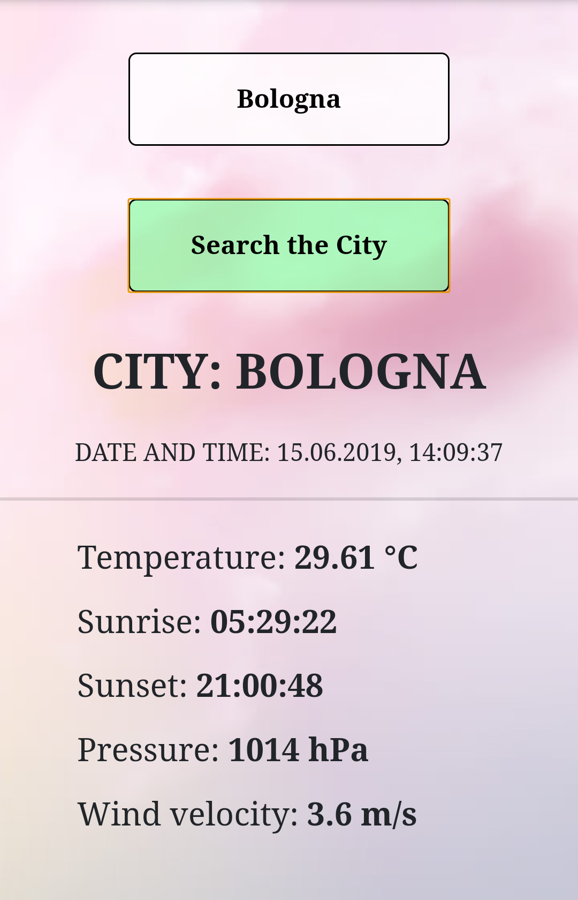

<!-- PROJECT LOGO -->
 

  <h3 align="center">Weather App</h3>
  

    Application showing actual weather in chosen city.
     
     
    <a href="https://skkarolinav.github.io/weather-app/">View Live Demo</a>
  

<!-- TABLE OF CONTENTS -->
## Table of Contents

* [About the Project](#about-the-project)
  * [Built With](#built-with)
* [Getting Started](#getting-started)
* [Usage](#usage)
* [License](#license)
* [Contact](#contact)

<!-- ABOUT THE PROJECT -->
## About The Project

Version for PC

Mobile version
 

This projects was created using React.js.

Specified city is searched in the database and then results are fetched which are:
* time and name of checked city
* temperature
* time of sunrise and sunset
* pressure
* wind velocity

### Built With
To create this application I used:
* [React.js](https://reactjs.org)
* [Bootstrap](https://getbootstrap.com) 
* [Weather Api](https://api.openweathermap.org)

<!-- GETTING STARTED -->
## Getting Started

To run this application just write the name of the city.

<!-- LICENSE -->
## License
Distributed under the MIT Licence.

#
<!-- CONTACT -->
## Contact

Name and Surname: Karolina Banasiewicz

E-mail: skkarolinav@gmail.com

GitHub: [Link](https://github.com/Skkarolinav)

LinkedIn: [Link](https://www.linkedin.com/in/karolina-banasiewicz-661a00188/)
